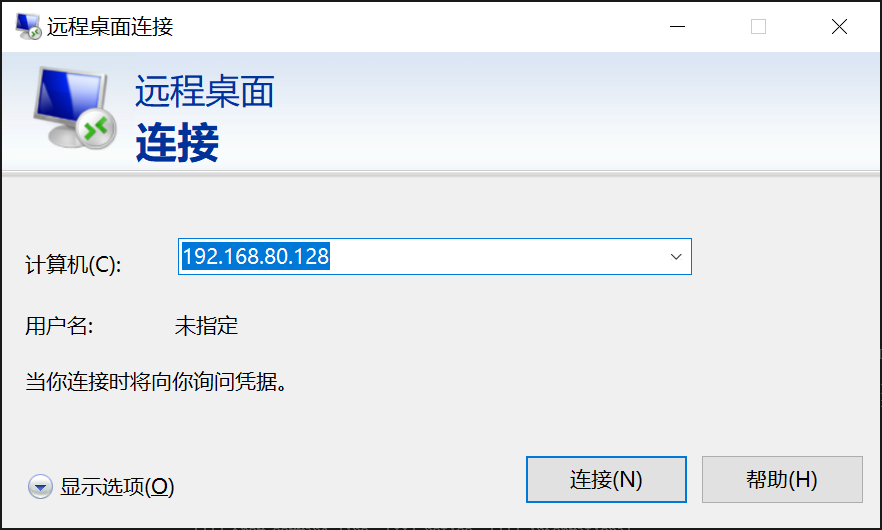
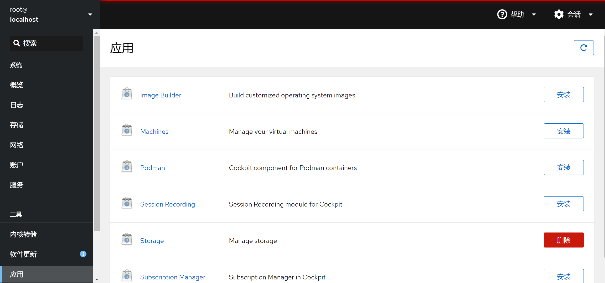

= Rocky Linux 9 虚拟机的配置

link:readme.adoc[返回目录]

首先去官网下载iso文件，安装最小化的Rocky Linux 9。

== 配置桌面

=== gnome桌面

`dnf groupinstall gnome base-x`

此时 `startx` 即可开启图形化界面。

[NOTE]
====
虽然，通过一些其他的指令可以使图形化界面开机自启，但是我不是任何时候都需要使用图形化界面。
====

=== 中文支持

`dnf install langpacks-zh_CN.noarch`

安装完成后，可以在 `Settings` 里修改默认语言了。

要在 `Settings -- Keyboard -- Input Source` 增加 `中文(智能拼音)` 后，键盘才支持中文输入。 

[TIP]
====
`dnf search Chinese`

可以看到和中文相关的所有包。
====

=== xrdp

安装xrdp

`dnf install epel-release`

`dnf install xrdp`

启动和开机自启xrdp

`systemctl start xrdp`

`systemctl enable xrdp`

配置防火墙

`firewall-cmd --permanent --zone=public --add-port=3389/tcp`

`firewall-cmd --reload`

安装xrdr服务后，即可使用Windows 10自带的远程桌面连接到linux。

[NOTE]
====
通过xrdp连接，Linux桌面的分辨率会随着Windows屏幕的分辨率的改变而相应地改变。

在没有client连接时，它占用的资源非常低，可以忽略不计，开机自启不影响性能。

xrdp完全可以代替VMware tools的功能。
====

=== firefox浏览器

`dnf install firefox`

这样即可安装firefox浏览器。

=== tor浏览器

在 `firefox浏览器` 中进行下载。

=== gedit

图形化界面中，基本的看文件要求，自带的文档查看器和文本编辑器gedit已经够了。

可以通过安装插件扩展gedit的功能。

`dnf install gedit-plugins`

[CAUTION]
====
在gedit的首选项中可以轻松修改所有插件的启动与否。
====

== 其他配置

=== cockpit

`dnf install cockpit`

`systemctl enable --now cockpit.socket`

cockpit使得用户可以通过浏览器访问9090断口来查看和管理Linux的各种状态，还可以管理podman。

=== gcc/g++

`dnf install g++ gcc`

=== podman

`dnf install podman`

`dnf install docker`

在红帽系的Linux中，安装docker会默认给装成podman，而且只会在用户使用docker命令时自动换成podman的相应命令。

podman是红帽的代替docker的软件，默认支持多个镜像源，其中包括了docker的源，且运行不需要root权限。

[IMPORTANT]
====
为了使vscode的docker插件能够连接podman，需要进行配置。

Terminal: 

* `systemctl --user enable --now podman.socket`

vscode settings:

* set 'docker.dockerodeOptions' (Docker: Dockerode Options) as {"socketPath":"/run/user/[user uid]/podman/podman.sock"}
* user uid可以通过 `cat /etc/passwd` 查看。
====

=== privoxy

`dnf install privoxy`

使用privoxy可以使终端的命令行工具也使用代理访问网络。

配置方式：

* 修改/etc/privoxy/config文件：
    - listen-address 127.0.0.1:8118      # 8118是默认端口，这句话默认已经存在
    - forward-socks5t / 127.0.0.1:1080 . # 转发到本地端口1080
* `systemctl start privoxy`
* `systemctl enable privoxy`

[CAUTION]
====
终端需要走代理时，在终端输入：

* `export http_proxy=http://127.0.0.1:8118`
* `export https_proxy=http://127.0.0.1:8118`

需要取消时，在终端输入：

* `unset http_proxy`
* `unset https_proxy`
====
